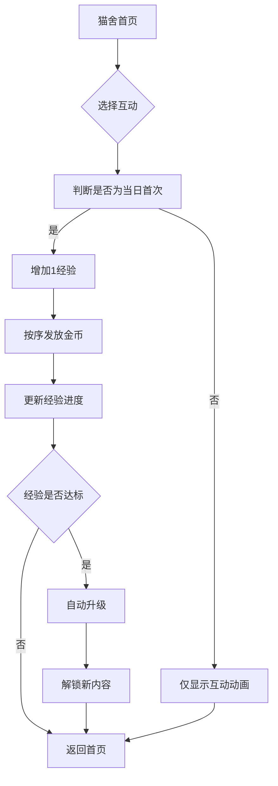

## 1. 产品概述
JIEYOU萌宠是一款社区养猫APP，所有用户共同养育一只猫咪。通过日常互动积累经验升级，解锁新内容，建立用户与虚拟宠物间的情感连接，同时促进社区用户间的协作与交流。

## 2. 核心功能

### 2.1 用户角色
| 角色 | 注册方式 | 核心权限 |
|------|----------|----------|
| 普通用户 | 邮箱/手机号注册 | 与猫咪互动、积累经验、获得金币、购买物品 |

### 2.2 功能模块
JIEYOU萌宠包含以下核心页面：
1. **猫舍首页**：展示猫咪状态、等级进度、互动操作区域
2. **商店页面**：食物、服装、装饰品的购买界面
3. **个人中心**：用户信息、金币余额、互动历史记录

### 2.3 页面详情
| 页面名称 | 模块名称 | 功能描述 |
|----------|----------|----------|
| 猫舍首页 | 猫咪展示区 | 显示猫咪形象、当前等级、经验进度条、今日互动状态 |
| 猫舍首页 | 互动操作区 | 提供喂食、撸猫、洗澡、逗猫棒、哄睡等互动按钮 |
| 猫舍首页 | 等级信息区 | 显示升级所需经验、解锁内容预览 |
| 商店页面 | 商品列表 | 展示可购买的食物、服装、装饰品 |
| 商店页面 | 金币显示 | 实时显示用户金币余额 |
| 个人中心 | 用户信息 | 显示用户名、注册时间、总互动次数 |
| 个人中心 | 金币记录 | 显示金币获得和消耗历史 |
| 个人中心 | 互动统计 | 显示每日互动完成情况和累计经验贡献 |

## 3. 核心流程

### 用户互动流程
1. 用户进入猫舍首页，查看猫咪当前状态
2. 选择互动类型（喂食、撸猫、洗澡、逗猫棒、哄睡）
3. 系统判断是否为当日首次互动
4. 如果是首次互动：增加1点经验值，按规则发放金币（第1次5枚、第2次4枚...第5次1枚）
5. 更新猫咪经验值和等级（达到阈值自动升级）
6. 显示互动动画和获得奖励提示

### 升级解锁流程
1. 猫咪经验值达到升级阈值
2. 自动升级到下一等级
3. 解锁对应等级的新内容（如新食物、服装、猫咪品种）
4. 在商店中显示新解锁商品
5. 向所有用户推送升级通知

## 4. 用户界面设计

### 4.1 设计风格
- **主色调**：温暖的橙粉色系（#FFB6C1）配米白色背景
- **按钮风格**：圆润的3D立体按钮，带有柔和阴影
- **字体**：可爱圆润的无衬线字体，主标题18-20px，正文14-16px
- **布局风格**：卡片式布局，圆角设计，大量留白营造温馨感
- **图标风格**：手绘风格的可爱emoji和动物图标

### 4.2 页面设计概述
| 页面名称 | 模块名称 | UI元素 |
|----------|----------|--------|
| 猫舍首页 | 猫咪展示区 | 居中显示猫咪动画形象，上方显示等级徽章，下方显示经验进度条，采用温暖的木质背景 |
| 猫舍首页 | 互动操作区 | 五个圆形按钮排成花朵形状，每个按钮有对应的emoji图标和文字说明，按钮有按压动画效果 |
| 商店页面 | 商品列表 | 网格布局展示商品卡片，每张卡片包含商品图片、名称、价格标签，已解锁商品彩色显示，未解锁商品灰度显示 |
| 个人中心 | 用户信息 | 顶部显示用户头像和昵称，中间显示金币余额大数字，下方用时间轴形式展示互动历史 |

### 4.3 响应式设计
- 采用桌面端优先设计，默认适配1280px以上屏幕
- 移动端自适应，互动按钮在手机上变为底部固定导航栏
- 支持触摸操作的按钮放大和动画反馈