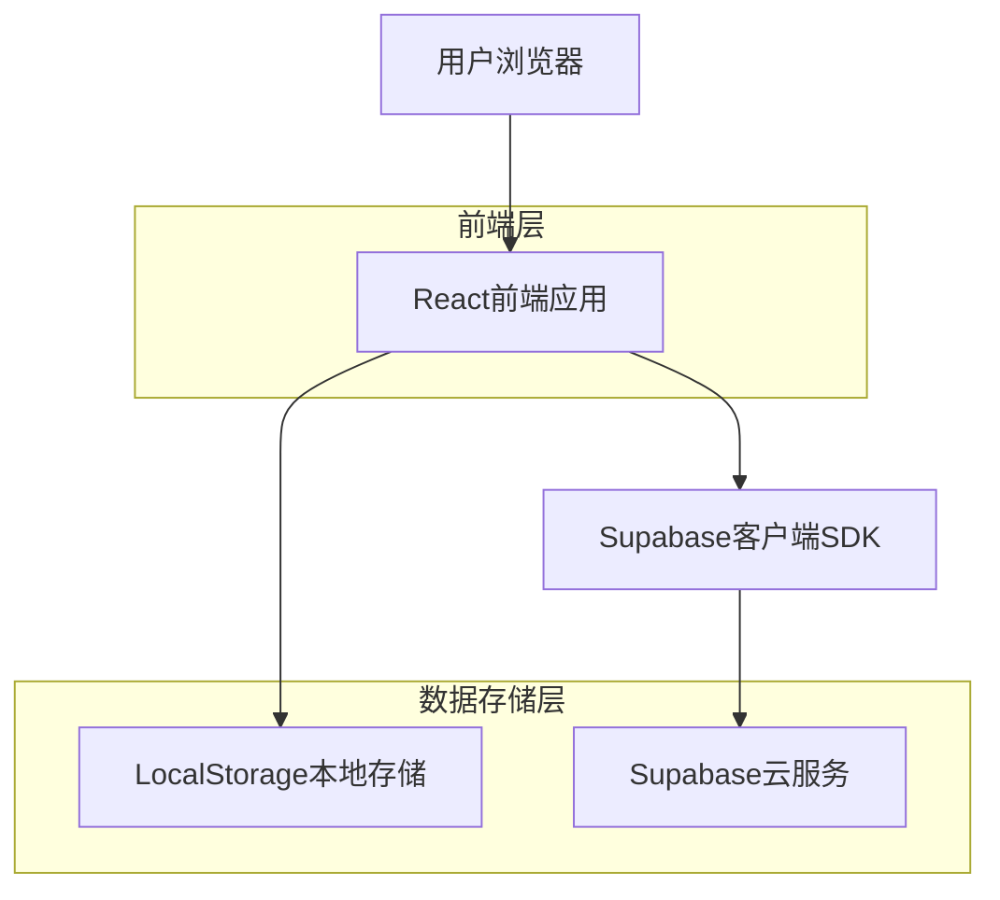
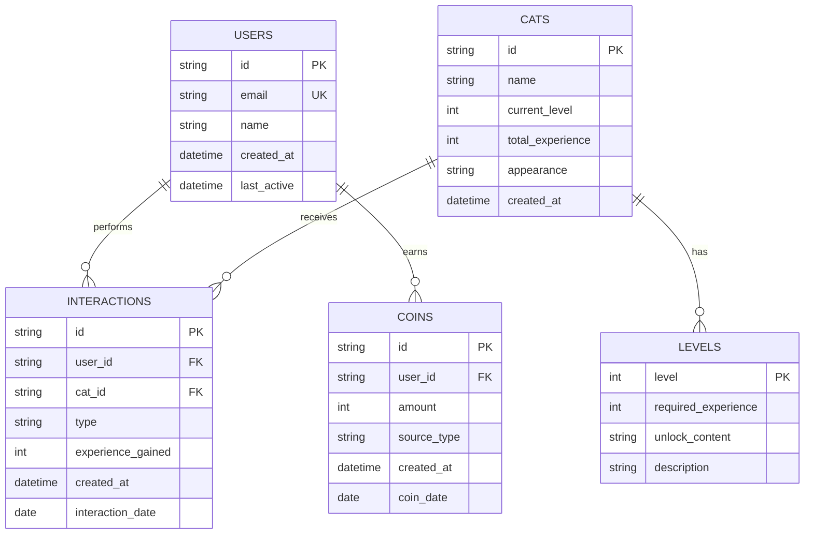

## 1. 架构设计



## 2. 技术描述

- **前端**: React@18 + tailwindcss@3 + vite
- **初始化工具**: vite-init
- **状态管理**: React Context + useReducer
- **UI组件库**: 自定义组件 + Radix UI
- **动画库**: Framer Motion
- **数据存储**: LocalStorage（Demo阶段）/ Supabase（生产环境）
- **后端**: 无独立后端，直接使用Supabase客户端SDK

## 3. 路由定义

| 路由 | 用途 |
|------|------|
| / | 猫舍首页，展示猫咪和互动操作 |
| /shop | 商店页面，购买食物、服装等商品 |
| /profile | 个人中心，查看用户信息和历史记录 |
| /login | 用户登录页面 |
| /register | 用户注册页面 |

## 4. 数据模型

### 4.1 核心数据表结构



### 4.2 数据定义语言

#### 用户表 (users)
```sql
-- 创建用户表
CREATE TABLE users (
    id UUID PRIMARY KEY DEFAULT gen_random_uuid(),
    email VARCHAR(255) UNIQUE NOT NULL,
    name VARCHAR(100) NOT NULL,
    created_at TIMESTAMP WITH TIME ZONE DEFAULT NOW(),
    last_active TIMESTAMP WITH TIME ZONE DEFAULT NOW()
);

-- 创建索引
CREATE INDEX idx_users_email ON users(email);
CREATE INDEX idx_users_last_active ON users(last_active);
```

#### 猫咪表 (cats)
```sql
-- 创建猫咪表
CREATE TABLE cats (
    id UUID PRIMARY KEY DEFAULT gen_random_uuid(),
    name VARCHAR(100) DEFAULT 'JIEYOU萌宠',
    current_level INTEGER DEFAULT 1,
    total_experience INTEGER DEFAULT 0,
    appearance VARCHAR(255) DEFAULT 'default',
    created_at TIMESTAMP WITH TIME ZONE DEFAULT NOW()
);

-- 创建索引
CREATE INDEX idx_cats_level ON cats(current_level);
```

#### 互动记录表 (interactions)
```sql
-- 创建互动记录表
CREATE TABLE interactions (
    id UUID PRIMARY KEY DEFAULT gen_random_uuid(),
    user_id UUID REFERENCES users(id) ON DELETE CASCADE,
    cat_id UUID REFERENCES cats(id) ON DELETE CASCADE,
    type VARCHAR(50) NOT NULL CHECK (type IN ('feed', 'pet', 'bath', 'play', 'sleep')),
    experience_gained INTEGER DEFAULT 1,
    created_at TIMESTAMP WITH TIME ZONE DEFAULT NOW(),
    interaction_date DATE DEFAULT CURRENT_DATE
);

-- 创建索引
CREATE INDEX idx_interactions_user_date ON interactions(user_id, interaction_date);
CREATE INDEX idx_interactions_cat ON interactions(cat_id);
CREATE INDEX idx_interactions_created ON interactions(created_at DESC);
```

#### 金币记录表 (coins)
```sql
-- 创建金币记录表
CREATE TABLE coins (
    id UUID PRIMARY KEY DEFAULT gen_random_uuid(),
    user_id UUID REFERENCES users(id) ON DELETE CASCADE,
    amount INTEGER NOT NULL,
    source_type VARCHAR(50) NOT NULL,
    created_at TIMESTAMP WITH TIME ZONE DEFAULT NOW(),
    coin_date DATE DEFAULT CURRENT_DATE
);

-- 创建索引
CREATE INDEX idx_coins_user_date ON coins(user_id, coin_date);
CREATE INDEX idx_coins_created ON coins(created_at DESC);
```

#### 等级配置表 (levels)
```sql
-- 创建等级配置表
CREATE TABLE levels (
    level INTEGER PRIMARY KEY,
    required_experience INTEGER NOT NULL,
    unlock_content TEXT,
    description VARCHAR(255)
);

-- 插入等级配置数据
INSERT INTO levels (level, required_experience, unlock_content, description) VALUES
(1, 0, '基础互动功能', '初始等级'),
(2, 10, '新食物：小鱼干', '解锁小鱼干食物'),
(3, 30, '新装饰：蝴蝶结', '解锁蝴蝶结装饰品'),
(4, 40, '新互动：梳毛', '解锁梳毛互动'),
(5, 70, '新食物：猫罐头', '解锁猫罐头'),
(6, 100, '新装饰：小帽子', '解锁小帽子'),
(7, 210, '新猫咪品种：橘猫', '解锁橘猫品种'),
(8, 320, '新食物：高级猫粮', '解锁高级猫粮'),
(9, 430, '新装饰：皇冠', '解锁皇冠'),
(10, 540, '终极奖励：猫城堡', '解锁豪华猫城堡');
```

### 4.3 Supabase权限配置

```sql
-- 基础权限设置
GRANT SELECT ON cats TO anon;
GRANT SELECT ON levels TO anon;
GRANT ALL ON users TO authenticated;
GRANT ALL ON interactions TO authenticated;
GRANT ALL ON coins TO authenticated;

-- RLS (Row Level Security) 策略
ALTER TABLE interactions ENABLE ROW LEVEL SECURITY;
ALTER TABLE coins ENABLE ROW LEVEL SECURITY;

-- 互动记录策略：用户只能查看自己的互动记录
CREATE POLICY "用户查看自己的互动记录" ON interactions
    FOR SELECT USING (auth.uid() = user_id);

-- 互动记录策略：用户只能创建自己的互动记录
CREATE POLICY "用户创建互动记录" ON interactions
    FOR INSERT WITH CHECK (auth.uid() = user_id);

-- 金币记录策略：用户只能查看自己的金币记录
CREATE POLICY "用户查看金币记录" ON coins
    FOR SELECT USING (auth.uid() = user_id);
```

## 5. 前端状态管理设计

### 5.1 全局状态结构
```typescript
interface AppState {
  user: {
    id: string;
    email: string;
    name: string;
    coinBalance: number;
  } | null;
  
  cat: {
    id: string;
    name: string;
    level: number;
    experience: number;
    maxExperience: number;
    appearance: string;
  };
  
  todayInteractions: {
    count: number;
    hasInteraction: (type: string) => boolean;
  };
  
  shop: {
    items: ShopItem[];
    unlockedItems: string[];
  };
}
```

### 5.2 关键业务逻辑

#### 互动经验计算
```typescript
function canGainExperience(userId: string, interactionType: string): boolean {
  const today = new Date().toDateString();
  const key = `interaction_${userId}_${today}_${interactionType}`;
  return !localStorage.getItem(key);
}

function getCoinReward(interactionCount: number): number {
  if (interactionCount > 5) return 0;
  return [5, 4, 3, 2, 1][interactionCount - 1];
}
```

#### 等级升级检查
```typescript
function checkLevelUp(currentExp: number, currentLevel: number): {
  newLevel: number;
  unlockedContent: string[];
} {
  const levelRequirements = [0, 10, 30, 40, 70, 100, 210, 320, 430, 540];
  let newLevel = currentLevel;
  
  for (let i = currentLevel; i < levelRequirements.length; i++) {
    if (currentExp >= levelRequirements[i]) {
      newLevel = i;
    } else {
      break;
    }
  }
  
  return {
    newLevel,
    unlockedContent: getUnlockedContent(currentLevel, newLevel)
  };
}
```